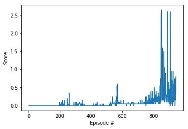
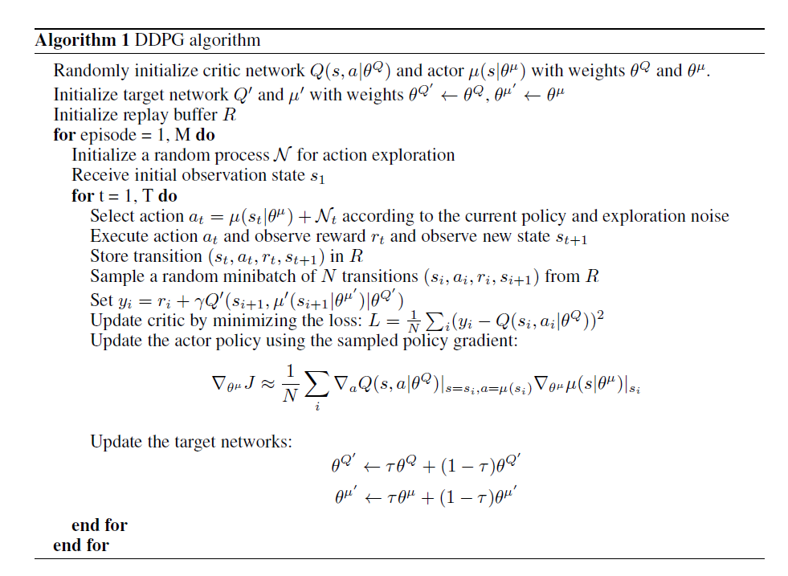

# Project 3: Collaboration and Competition

### Learning Algorithm

The learning algorithm implemented is a Deep Deterministic Policy Gradient (DDPG) model.   Specifically, a modified [ddpg-pendulum](https://github.com/atlas604/deep-reinforcement-learning/tree/master/ddpg-pendulum) model is used to solve the environment.   

Unlike the Deep Q Network (DQN) algorithms, DDPG isn’t constrained with discrete and low-dimensional action spaces.  This is critical for our purposes of interacting with continuous action spaces.  

In DDPG, two neural networks are used instead of one, an actor and a critic.  The actor is used to approximate the optimal policy deterministically, which is essentially what it perceives as the best possible action.  The critic on the other hand uses the actor’s decision to evaluate the optimal action value function.

In this implementation, I apply the same DDPG model architecture used in the previous project(Continuous Control). Since the model was already adjusted to collect the data multiple agents simultaneously, it was a perfect starting point for this project.  

Evidently, the model was able to be solve the environment in 943 episodes with no adjustments.     




**DDPG Algorithm**



Source: Timothy P. Lillicrap, Jonathan J. Hunt, Alexander Pritzel, Nicolas Heess, Tom Erez, Yuval Tassa, David Silver, Daan Wierstra.  Continuous control with deep reinforcement learning.  arXiv:1509.02971 [cs.LG], 2015.

Hyperparameters chosen:

```BUFFER_SIZE = int(1e6)  # replay buffer size
BATCH_SIZE = 256        # minibatch size
GAMMA = 0.99            # discount factor
TAU = 1e-3              # for soft update of target parameters
LR_ACTOR = 1e-3         # learning rate of the actor
LR_CRITIC = 1e-3        # learning rate of the critic
WEIGHT_DECAY = 0.0000   # L2 weight decay
```

Both Actor and Critic neural networks were initialized with two hidden layers of 128 nodes and with batch normalization implemented between each linear functions.  

In each episode, both agent's experience(observations and actions) are combined and processed and thus only one actor and critic is required to formulate an optimal action value function.  This worked well because the state space and action space is essentially the same between the agents but only mirrored.  


### Ideas for Future Work

The DDPG hyperparameters can definitely be optimized to improve the model.  With optimal values, the agent can most likely be trained even quicker and demonstrate a smoother learning progression.  

Other actor-critic models should also be explored because some may consider ddpg not a true actor-critic algorithm.  

Other implementations of separate actor and critic neural networks for each agent should also be tested to see how it affects performance.  However having additional neural networks would require more computational resources.  
